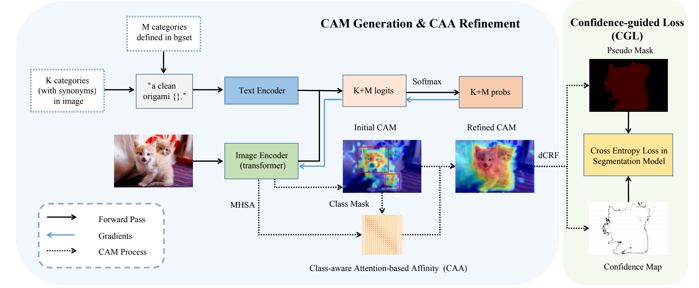

[](https://paperswithcode.com/sota/weakly-supervised-semantic-segmentation-on?p=clip-is-also-an-efficient-segmenter-a-text)
[](https://paperswithcode.com/sota/weakly-supervised-semantic-segmentation-on-1?p=clip-is-also-an-efficient-segmenter-a-text)
[](https://paperswithcode.com/sota/weakly-supervised-semantic-segmentation-on-4?p=clip-is-also-an-efficient-segmenter-a-text)
# CLIP is Also an Efficient Segmenter: A Text-Driven Approach for Weakly Supervised Semantic Segmentation (CVPR 2023)
[[paper]](https://openaccess.thecvf.com/content/CVPR2023/html/Lin_CLIP_Is_Also_an_Efficient_Segmenter_A_Text-Driven_Approach_for_CVPR_2023_paper.html)


## Reqirements

```
# create conda env
conda create -n clip-es python=3.9
conda activate clip-es

# install packages
pip install torch==1.7.1+cu101 torchvision==0.8.2+cu101 -f https://download.pytorch.org/whl/torch_stable.html
pip install opencv-python ftfy regex tqdm ttach tensorboard lxml cython

# install pydensecrf from source
git clone https://github.com/lucasb-eyer/pydensecrf
cd pydensecrf
python setup.py install
```

## Preparing Datasets
### PASCAL VOC2012
Download images in PASCAL VOC2012 dataset at [here](http://host.robots.ox.ac.uk/pascal/VOC/voc2012/) and the train_aug groundtruth at [here](http://home.bharathh.info/pubs/codes/SBD/download.html).
The structure of `/your_home_dir/datasets/VOC2012`should be organized as follows:

```
---VOC2012/
       --Annotations
       --ImageSets
       --SegmentationClass
       --SegmentationClassAug
```

### MS COCO2014
Download MS COCO images from the [official website](https://cocodataset.org/#download).
Download semantic segmentation annotations for the MS COCO dataset at [here](https://drive.google.com/file/d/1pRE9SEYkZKVg0Rgz2pi9tg48j7GlinPV/view?usp=sharing).
The structure of `/your_home_dir/datasets/COCO2014`are suggested to be organized as follows:
```
---COCO2014/
       --Annotations
       --ImageSets
           -train2014
           -val2014
       --SegmentationClass
```

### Preparing pre-trained model
Download CLIP pre-trained [ViT-B/16] at [here](https://openaipublic.azureedge.net/clip/models/5806e77cd80f8b59890b7e101eabd078d9fb84e6937f9e85e4ecb61988df416f/ViT-B-16.pt) and put it to `/your_home_dir/pretrained_models/clip`.

## Usage
### Step 1. Generate CAMs for train (train_aug) set.
```
# For VOC12
CUDA_VISIBLE_DEVICES=0 python generate_cams_voc12.py --img_root /your_home_dir/datasets/VOC2012/JPEGImages --split_file ./voc12/train_aug.txt --model /your_home_dir/pretrained_models/clip/ViT-B-16.pt --num_workers 1 --cam_out_dir ./output/voc12/cams

# For COCO14
CUDA_VISIBLE_DEVICES=0 python generate_cams_coco14.py --img_root /your_home_dir/datasets/COCO2014/JPEGImages/train2014 --split_file ./coco14/train.txt --model /your_home_dir/pretrained_models/clip/ViT-B-16.pt --num_workers 1 --cam_out_dir ./output/coco14/cams
```

### Step 2. Evaluate generated CAMs and use CRF to postprocess
```
# (optional) evaluate generated CAMs
## for VOC12
python eval_cam.py --cam_out_dir ./output/voc12/cams --cam_type attn_highres --gt_root /your_home_dir/datasets/VOC2012/SegmentationClassAug --split_file ./voc12/train.txt
## for COCO14
python eval_cam.py --cam_out_dir ./output/coco14/cams --cam_type attn_highres --gt_root /your_home_dir/datasets/COCO2014/SegmentationClass --split_file ./coco14/train.txt

# use CRF process to generate pseudo masks 
(realize confidence-guided loss by setting pixels with low confidence to 255)
## for VOC12 
python eval_cam_with_crf.py --cam_out_dir ./output/voc12/cams --gt_root /your_home_dir/datasets/VOC2012/SegmentationClassAug --image_root /your_home_dir/datasets/VOC2012/JPEGImages --split_file ./voc12/train_aug.txt --pseudo_mask_save_path ./output/voc12/pseudo_masks
## for COCO14
python eval_cam_with_crf.py --cam_out_dir ./output/coco14/cams --gt_root /your_home_dir/datasets/COCO2014/SegmentationClass --image_root /your_home_dir/datasets/COCO2014/JPEGImages/train2014 --split_file ./coco14/train.txt --pseudo_mask_save_path ./output/coco2014/pseudo_masks

# eval CRF processed pseudo masks
## for VOC12 
python eval_cam_with_crf.py --cam_out_dir ./output/voc12/cams --gt_root /your_home_dir/datasets/VOC2012/SegmentationClassAug --image_root /your_home_dir/datasets/VOC2012/JPEGImages --split_file ./voc12/train_aug.txt --eval_only
## for COCO14
python eval_cam_with_crf.py --cam_out_dir ./output/coco14/cams --gt_root /your_home_dir/datasets/COCO2014/SegmentationClass --image_root /your_home_dir/datasets/COCO2014/JPEGImages/train2014 --split_file ./coco14/train.txt --eval_only

```
The generated pseudo masks of VOC12 and COCO14 can be found at [Google Drive](https://drive.google.com/drive/folders/1i9fp2c87s5ungxFpLFgUm_zUACpLuKtJ?usp=sharing).
### Step 3. Train Segmentation Model
To train DeepLab-v2, we refer to [deeplab-pytorch](https://github.com/kazuto1011/deeplab-pytorch). The ImageNet pre-trained model can be found in [AdvCAM](https://github.com/jbeomlee93/AdvCAM).

## Results
### The quality of generated pseudo masks on PASCAL VOC2012 train set.
| Method | CAMs | +CRF |
| --- | --- | --- | 
| CLIP-ES | 70.8 | 75.0 |
### Segmentation results on PASCAL VOC2012 val and test sets.
| Method | Network | Pretrained | val | test |
| --- | --- | --- | --- | --- |
| CLIP-ES | DeepLabV2 | ImageNet | 71.1 | 71.4 |
| CLIP-ES | DeepLabV2 | COCO | 73.8 | 73.9 |
### Segmentation results on MS COCO2014 val set.
| Method | Network | Pretrained | val | 
| --- | --- | --- | --- | 
| CLIP-ES | DeepLabV2 | ImageNet | 45.4 | 
## Acknowledgement
We borrowed the code from [CLIP](https://github.com/openai/CLIP) and [pytorch_grad_cam](https://github.com/jacobgil/pytorch-grad-cam/tree/61e9babae8600351b02b6e90864e4807f44f2d4a). Thanks for their wonderful works.

## Citation
If you find this project helpful for your research, please consider citing the following BibTeX entry.
```
@InProceedings{Lin_2023_CVPR,
    author    = {Lin, Yuqi and Chen, Minghao and Wang, Wenxiao and Wu, Boxi and Li, Ke and Lin, Binbin and Liu, Haifeng and He, Xiaofei},
    title     = {CLIP Is Also an Efficient Segmenter: A Text-Driven Approach for Weakly Supervised Semantic Segmentation},
    booktitle = {Proceedings of the IEEE/CVF Conference on Computer Vision and Pattern Recognition (CVPR)},
    month     = {June},
    year      = {2023},
    pages     = {15305-15314}
}
```